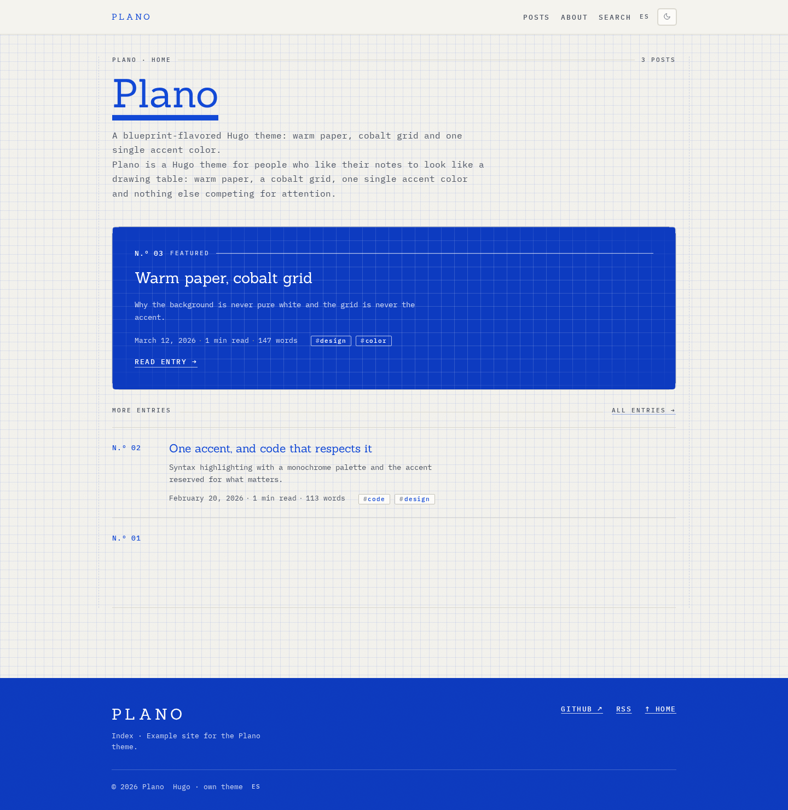

# Plano

A Hugo theme with a drawing-table feel: warm paper, a cobalt grid, one single
accent color, and an optional dark variant that never turns itself on.


[Live demo](https://vstrofago.github.io/blog/) · [Example site](exampleSite/) ·
[MIT](LICENSE) theme, SIL OFL fonts



## Why this theme is shaped like this

Plano comes from a small design system with opinions, and it keeps them:

- **One accent color.** Links, active numbers, keyword highlights, the rule
  under a heading: all the same cobalt. Nothing else gets to be colored.
- **Paper, not white.** The background is a warm off-white with a faint grid.
  The grid carries structure and never competes with the text.
- **Light is canonical.** The design system declares a single light mode. The
  dark variant exists because readers ask for it, is fully isolated, and is
  opt-in only.
- **No build step.** Plain HTML, CSS and JavaScript. No npm, no bundler, no
  framework at runtime. The CSS is ~48 KB in source (33 KB minified) and the
  JavaScript ~7 KB (3 KB minified).
- **Fonts are self-hosted.** No requests to third-party font services.

## Requirements

Hugo **extended** 0.146.0 or newer (built and verified with 0.166.0). The theme
uses `_partials` and `_markup` directory conventions and `pagerSize`, so older
Hugo versions will not work. Nothing else is needed: no Node, no PostCSS.

## Install

As a submodule:

```bash
git submodule add https://github.com/vstrofago/hugo-theme-plano themes/plano
```

As a Hugo module (in `hugo.toml`):

```toml
[[module.imports]]
  path = 'github.com/vstrofago/hugo-theme-plano'
```

Or just copy the repository into `themes/plano/`.

Then declare it:

```toml
theme = 'plano'
```

## Configure

The [example site](exampleSite/) is the reference configuration; the pieces the
theme actually reads are these.

```toml
baseURL = 'https://example.org/'
title = 'Your site'
theme = 'plano'
defaultContentLanguage = 'en'
defaultContentLanguageInSubdir = false

[pagination]
  pagerSize = 10

[languages]
  [languages.en]
    label = 'English'
    locale = 'en-US'
    contentDir = 'content/en'
    weight = 1
    [languages.en.params]
      description = 'Shown in the footer and in the meta description.'
      DateFormat = 'January 2, 2006'
      [languages.en.params.homeInfoParams]
        Title = 'Hero title'
        Content = 'Hero lead, written in **markdown**.'
    [[languages.en.menu.main]]
      name = 'Posts'
      url = 'posts/'
      weight = 10

[params]
  author = 'Your name'
  mainSections = ['posts']
  homeLimit = 5
  ShowReadingTime = true
  ShowWordCount = true
  ShowLastMod = false
  ShowBreadCrumbs = true
  ShowPostNavLinks = true
  ShowRssButtonInSectionTermList = true
  ShowToc = true
  TocOpen = false
  disableThemeToggle = false
  tagline = ''                     # optional: small label next to the wordmark
  socialIcons = [{ name = 'GitHub', url = 'https://github.com/you' }]

[markup]
  [markup.highlight]
    noClasses = false              # required: the syntax theme is class-based
  [markup.tableOfContents]
    startLevel = 2
    endLevel = 3

[taxonomies]
  tag = 'tags'
  category = 'categories'

[outputs]
  home = ['HTML', 'RSS', 'JSON']   # JSON feeds the search index
```

Two things are easy to miss and both are required:

1. `home = ['HTML', 'RSS', 'JSON']`. Without the JSON output the search page has
   no index to read.
2. `noClasses = false` under `markup.highlight`. Otherwise Chroma inlines styles
   and the syntax theme stops applying.

For the search page, add `content/<lang>/search.md`:

```yaml
---
title: "Search"
layout: "search"
translationKey: "search"
---
```

## The dark variant

Rules, in order of importance:

- **It never turns itself on.** There is no `prefers-color-scheme` anywhere in
  the theme. Without JavaScript, or without a previous explicit choice, the site
  is light.
- **It cannot leak into the light theme.** Every dark rule lives in
  `assets/css/vf-dark.css` behind `html[data-theme="dark"]`. It redefines surface
  colors and a handful of component fills; the light theme and its tokens are
  untouched.
- **Your choice is remembered** in `localStorage` on that device, and pressing the
  toggle again returns you to light.

Set `disableThemeToggle = true` to remove the button and stay light forever.

Both modes are audited for contrast on every route (see below), so the dark
variant is not an afterthought that only looks right in a screenshot.

## Fonts

Sanchez (serif) and IBM Plex Mono (labels, meta, code), both SIL Open Font
License 1.1, both bundled unmodified in `static/fonts/` with the license text in
[`static/fonts/OFL.txt`](static/fonts/OFL.txt). To use your own, replace the files
and update `assets/css/tokens/fonts.css`; the only other place fonts are named is
the token file for typography.

## Example site and local development

`exampleSite/` is a complete bilingual site that builds on its own. The theme is
this repository, so a build needs the repo visible as `themes/plano`. The CI does
exactly this, and you can reproduce it locally:

```bash
site=$(mktemp -d)/site
mkdir -p "${site}/themes"
rsync -a --exclude .git --exclude exampleSite ./ "${site}/themes/plano/"
rsync -a ./exampleSite/ "${site}/"
hugo --source "${site}" --gc --minify --panicOnWarning --baseURL http://localhost:1314/
```

To look at it in a browser, serve the built site:

```bash
python3 -m http.server 1314 --directory "${site}/public"
```

## What was verified, and how

The theme is checked in a real browser (Chromium), not by eye:

- **Contrast**, measured on every route in both modes: each text element is
  compared against its effective background, with the threshold set by its size
  (4.5:1 normal, 3:1 large). Zero failures. This is what caught the code plate's
  punctuation at 2.88:1 and the breadcrumb's current page at 3.43:1.
- **No missing resources and no JavaScript errors** across the routes.
- **Responsive** down to 390 px with no horizontal overflow and nothing hidden.
- **Reduced motion**: with `prefers-reduced-motion: reduce` nothing is armed and
  every element sits in its final state.
- **Fonts actually load**: verified by measuring rendered text width, not by
  trusting the `@font-face` declaration.

The screenshots in this README come from the example site.

## Notes and deliberate deviations

- Comments in the templates are written in Spanish, the author's language. The
  theme itself is language-neutral: all user-facing strings live in `i18n/`
  (`en.toml`, `es.toml`, add your own).
- The source design system imported fonts from Google Fonts; this theme
  self-hosts them instead.
- The `exampleSite/` dates are fixed so the demo is stable; they are not real
  entries.

## License

Theme: [MIT](LICENSE). Fonts: SIL OFL 1.1 (see
[`static/fonts/OFL.txt`](static/fonts/OFL.txt)).

---

## En español

**Plano** es un tema de Hugo con aire de mesa de dibujo: papel cálido, rejilla
cobalto, un único color de acento y una variante oscura opcional que nunca se
enciende sola.

- **Requisitos**: Hugo *extended* 0.146.0 o superior. Sin Node, sin build step.
- **Instalación**: como submódulo (`themes/plano`), como módulo de Hugo, o
  copiando el repositorio; después, `theme = 'plano'`.
- **Claro y oscuro**: el claro es el estado canónico. El oscuro vive aislado en
  `assets/css/vf-dark.css` detrás de `html[data-theme="dark"]`, se activa con el
  botón de la cabecera y se recuerda en el dispositivo. No hay
  `prefers-color-scheme` en ninguna parte.
- **Bilingüe**: los idiomas se declaran en `hugo.toml`; las cadenas de la interfaz
  están en `i18n/` y el tema trae inglés y español.
- **Búsqueda**: en el navegador, sobre un índice JSON que genera Hugo. Necesita
  `home = ['HTML', 'RSS', 'JSON']` en `outputs`.
- **Configuración de referencia**: el [`exampleSite/`](exampleSite/) completo.
- **Licencias**: MIT para el tema; las fuentes (Sanchez e IBM Plex Mono) son SIL
  OFL 1.1 y se distribuyen sin modificar con su licencia en
  [`static/fonts/OFL.txt`](static/fonts/OFL.txt).
